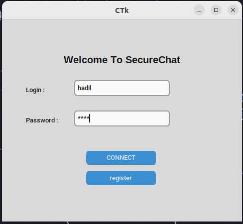
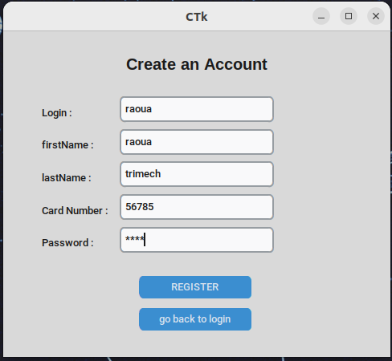
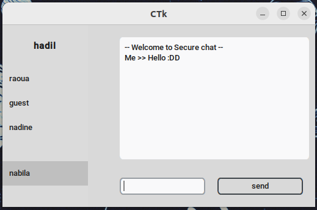

# SecureChat
SecureChat is  desktop application built with python where you can send secure messages encrypted with RSA

# ScreenShots

<table align="center">
  <tr>
    <td>Login</td>
     <td>Register</td>
     <td colspan="2"> ChatRoom </td>
  </tr>
  <tr>
    <td></td>
    <td></td>
    <td></td>
  </tr>
   </table>

## Collaborators
This project was developped by :
| Raoua Trimech | Hadil Helali |
| --- | --- |
